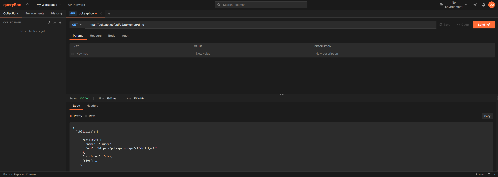

# queryBox

**queryBox** es un cliente HTTP web — al estilo de Postman o Insomnia — para construir, enviar y depurar peticiones API directamente desde el navegador. Construido con **Astro 5**, **Preact** y **Bun**, con TypeScript en modo estricto y un flujo de desarrollo guiado por agentes.



## ✨ Qué hace

- **Editor de requests**: método, URL, params, headers, body y auth en una sola barra de trabajo, con pestañas por request (`TabBar`)
- **Colecciones**: organiza y guarda requests en carpetas reutilizables
- **Environments**: variables de entorno con interpolación (`{{variable}}`) en URL, headers y body
- **Historial**: registro automático de requests enviadas, con reintento rápido
- **Visor de respuesta**: body, headers y código de estado, con generación de snippets de código (`CodeSnippetModal`) para reproducir la request en otros lenguajes/herramientas
- **Import/Export**: importa y exporta colecciones y environments
- **Diagnóstico de errores con IA** (Groq): cuando una request falla o responde 4xx/5xx, un botón "Diagnosticar con AI" analiza el error y sugiere soluciones accionables

## 🚀 Project Structure

```text
src/
├── assets/icons/       # SVG icons (importados con ?raw)
├── components/         # UI organizada por área
│   ├── header/         #   Barra superior + EnvironmentSelector
│   ├── footer/         #   Barra inferior
│   ├── sidebar/        #   CollectionPanel, HistoryPanel, EnvironmentPanel
│   ├── request/        #   RequestBar, RequestConfigTabs, AuthEditor, BodyEditor
│   ├── response/       #   ResponsePanel, ResponseTabs, CodeViewer
│   ├── workbench/      #   HttpWorkbench (isla principal), TabBar, CodeSnippetModal
│   └── shared/         #   Dropdown, Tabs, KeyValueTable, MethodBadge, ImportModal
├── layouts/             # Layout.astro (HTML base) + AppLayout.astro (grid shell)
├── pages/               # Rutas basadas en archivos
│   ├── index.astro     #   Entrada de la single page app
│   └── api/             #   Rutas de API server-side (prerender = false)
├── scripts/             # Custom Elements (TS vanilla): tabs, dropdown, tree, sidebar
├── server/              # Código server-only (groq-service, rate-limiter)
├── services/            # Servicios de cliente (storage, http-client, ai-client)
├── stores/              # Preact signals (tab, http, history, collection, environment, ui, ai-diagnosis)
├── styles/              # global.css con tokens de Tailwind v4
├── test/                # Infraestructura de tests (setup.ts, factories.ts)
├── types/               # Tipos TypeScript (http, auth, environment, persistence, export, snippet, ai)
└── utils/               # Funciones puras (url, auth, interpolation, snippet-generators, export-import)

docs/              # Documentación de features y planes de implementación
.claude/           # Definiciones y memoria de agentes
```

Learn more at [Astro project structure](https://docs.astro.build/en/basics/project-structure/).

## 🧞 Commands

Todos los comandos usan Bun:

| Command                | Action                                                    |
| :---------------------- | :--------------------------------------------------------- |
| `bun install`           | Instala dependencias                                        |
| `bun dev`               | Inicia el servidor de desarrollo en `localhost:4321`         |
| `bun run build`         | Compila para producción en `./dist/` (⚠️ no `bun build`)     |
| `bun preview`           | Previsualiza el build de producción localmente               |
| `bun astro check`       | Verifica tipos de TypeScript y Astro                         |
| `bun run test`          | Ejecuta los tests con Vitest (⚠️ no `bun test`)               |
| `bun run test:watch`    | Tests en modo watch                                           |
| `bun run test:coverage` | Cobertura (umbral: 70% statements/branches/functions/lines)  |
| `bun astro add`         | Añade integraciones (ej. React, Tailwind)                    |

> **Importante**: `bun test` ≠ `bun run test`. El primero usa el runner nativo de Bun (falla con `localStorage is not defined`); el segundo ejecuta Vitest vía los scripts de `package.json`.

## 🏗️ Development Workflow

Este proyecto usa agentes especializados para el desarrollo estructurado:

1. **Planning** — El agente `planner` clarifica requisitos, crea una rama `feature/[nombre]` y diseña un plan de implementación
2. **Implementation** — El agente `senior-developer` implementa exactamente lo que especifica el plan
3. **Review** — El agente `code-review` valida la implementación contra el plan y los estándares de calidad
4. **Security Audit** (opcional) — El agente `security-auditor` audita endpoints y código server-side

Los planes de features se guardan en `docs/[feature-name]/` con criterios de aceptación y decisiones técnicas documentadas.

## 💻 Stack

- **Framework**: Astro 5 (con islas Preact para interactividad)
- **UI reactiva**: Preact + `@preact/signals` para el estado (stores)
- **Package Manager**: Bun
- **Language**: TypeScript (strict mode)
- **Styling**: Tailwind CSS v4
- **IA**: Groq SDK (diagnóstico de errores)
- **Testing**: Vitest + happy-dom
- **Deploy**: adapter `@astrojs/vercel`

## 🤖 AI-Powered Error Diagnosis

Este proyecto incluye diagnóstico inteligente de errores HTTP mediante IA (Groq SDK). Cuando una solicitud HTTP falla o retorna un error (4xx/5xx), puedes obtener un análisis y sugerencias accionables generadas por IA.

### Configuración

1. **Obtén una API key de Groq** en https://console.groq.com
2. **Copia el archivo de ejemplo**:
   ```bash
   cp .env.example .env
   ```
3. **Edita `.env`** y configura tu `GROQ_API_KEY`:
   ```env
   GROQ_API_KEY=gsk_tu_key_aquí
   ```

### Rate Limiting (opcional)

Puedes ajustar los límites de rate limiting en `.env`:
- `AI_RATE_LIMIT_MAX` — máximo de requests por ventana (default: 10)
- `AI_RATE_LIMIT_WINDOW_MS` — tamaño de ventana en ms (default: 60000)

### Deployment

⚠️ **Este feature requiere un servidor Node.js** — no puede deployarse como sitio estático. El proyecto usa `@astrojs/node` adapter en modo `standalone`. Las páginas siguen siendo estáticas; solo el endpoint `/api/diagnose` se ejecuta en el servidor.

### Uso

- Cuando una request falla (CORS, timeout, network error), verás un botón **"Diagnosticar con AI"**
- Para respuestas HTTP con status ≥ 400, el botón aparece en la barra de estado
- El sistema muestra una preview de los datos antes de enviarlos a Groq (credenciales NUNCA se envían)
- El diagnóstico se genera en streaming con sugerencias accionables

## 📚 Documentation

- [Astro Docs](https://docs.astro.build)
- [TypeScript Config](./tsconfig.json)
